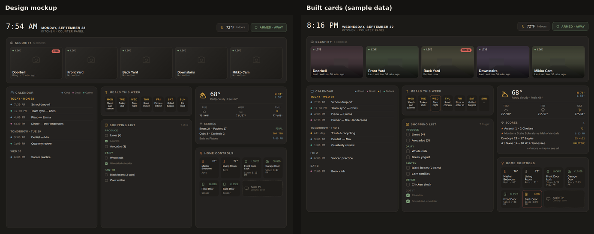

# Counter Panel Cards

A matching set of Home Assistant dashboard cards for a wall-mounted kitchen panel (built for an iPad in landscape). Together they reproduce the **Counter Panel** design: a clock and status header, a row of camera tiles, then calendar, meals and shopping, weather and scores, and home controls.



<sub>Rendered from sample data. Screenshots use stand-in fonts and drawn camera images; on your dashboard the cards load Barlow Condensed, Work Sans and IBM Plex Mono, and show your real camera snapshots.</sub>

| Card | Shows | Reads |
|---|---|---|
| `counter-layout-card` | Full-width rows and equal columns with the panel's spacing; columns stack on narrow screens | other cards |
| `counter-header-card` | Clock and date, a sideways-scrolling strip of home controls, alarm status | thermostats, locks, covers, door sensors, lights…, an `alarm_control_panel` |
| `counter-cameras-card` | Camera tiles: snapshot, LIVE dot, MOTION / RING badge, last motion | `camera`, motion `binary_sensor`, doorbell `event` or `binary_sensor` |
| `counter-calendar-card` | Agenda for the next days, merged from several calendars, a colour per calendar | `calendar` entities |
| `counter-meals-card` | Monday–Sunday dinners | a `calendar` (e.g. a Local Calendar called Meals) or a fixed list |
| `counter-shopping-card` | A to-do list you tick off from the panel, grouped by aisle | a `todo` entity |
| `counter-weather-card` | Current conditions, today's high/low, 3-day outlook (scrolls if space is short) | a `weather` entity (+ League Scoreboard Card for scores) |
| `counter-controls-card` | Thermostats, locks, garage doors, door sensors, lights/switches, media players, placeholders | those entities |

Colours come from your theme (with Counter Panel defaults), so seasonal theme changes carry through. Everything is plain JavaScript in one file: no build step, no dependencies.

## Hiding Home Assistant's top bar

The panel is meant to run full screen. Install **Kiosk Mode** from HACS and add this at the top of the dashboard YAML (it's in `examples/kitchen-dashboard.yaml`):

```yaml
kiosk_mode:
  non_admin_settings:      # e.g. the Kitchen Display login on the iPad; admins still see the bar to edit
    hide_header: true
    hide_sidebar: true
```

Add `?kiosk` to the dashboard address to hide the bar on any device, or `?disable_km` to bring it back.

## Install

### HACS
1. HACS → ⋮ → **Custom repositories** → paste this repository's URL, type **Dashboard** → Add.
2. Search **Counter Panel Cards** → Download.
3. Hard-refresh the browser (Cmd/Ctrl+Shift+R). On an iPad, close and reopen the page.

### Manual
Copy `counter-panel-cards.js` to `config/www/`, then Settings → Dashboards → ⋮ → **Resources** → `/local/counter-panel-cards.js`, JavaScript module.

## Quick start

1. **Theme:** copy [`examples/themes.yaml`](examples/themes.yaml) into `config/themes.yaml` (it adds the panel's colours and fonts to the four seasonal themes), then Cmd/Ctrl+K → "Reload themes".
2. **Dashboard:** open your kitchen dashboard → Edit → ⋮ → **Raw configuration editor**, paste [`examples/kitchen-dashboard.yaml`](examples/kitchen-dashboard.yaml), and swap the entity IDs for yours.
3. **Meals calendar** (optional): Settings → Devices & Services → Add Integration → **Local Calendar**, name it "Meals". Add one all-day event per dinner from the Calendar page in the sidebar. Repeating events work too ("Taco night" every Wednesday).
4. **Shopping aisles** (optional): write items as `Produce: Limes` or `Dairy: Milk` and they're grouped under those headings. Plain items go under "Other", or show as a simple list if nothing has a prefix.

## Card options

### counter-layout-card
```yaml
type: custom:counter-layout-card
padding: 24        # outer padding, px
gap: 16            # space between cards, px
stack_below: 900   # below this screen width, columns stack (and the page scrolls normally)
fit_screen: true   # fill exactly the screen height; the last card in each column scrolls inside instead of the page
min_column_height: 320   # the column row never gets shorter than this
min_card_height: 160     # a scrolling card never gets shorter than this
rows:
  - card: { type: custom:counter-header-card, ... }      # one full-width card
  - columns:                                              # equal-width columns
      - [ { type: custom:counter-calendar-card, ... } ]
      - [ { ... }, { ... } ]
    fill_last: true  # last card in each column stretches to the row's height (default)
    grow: true       # with fit_screen, this row takes the height left over (default for column rows)
```

With `fit_screen`, the calendar, shopping list and controls cards scroll inside themselves: titles stay put, a fade shows when there's more below, the list keeps its place when the card refreshes, and it slides back to the top after a minute without a touch. Set `scroll_reset` on any of those cards (seconds, `0` to turn off) to change that.

### counter-header-card
```yaml
subtitle: Kitchen · Counter Panel
alarm_entity: alarm_control_panel.home   # pinned at the right; tap opens it
tile_width: 210                          # width of each control tile, px
controls:                                # same items as counter-controls-card; the strip scrolls sideways
  - entity: climate.living_room
  - entity: lock.front_door
  - entity: light.kitchen                # lights/switches toggle on tap
temperature_entity: climate.living_room  # optional: an extra temperature tile at the start of the strip
```
The clock updates without redrawing the strip, and the strip keeps its scroll position through updates (it slides back to the start after `scroll_reset` seconds, default 60). Below 1000 px wide the strip moves onto its own row.

### counter-cameras-card
```yaml
cameras:
  - entity: camera.doorbell
    name: Doorbell
    ring: event.doorbell_doorbell       # event or binary_sensor; shows RING for a few minutes after a press
    motion: binary_sensor.doorbell_motion
title: Security
columns: 5          # default: number of cameras, max 5
height: 150         # tile height, px
refresh: 10         # snapshot refresh, seconds
recent_minutes: 5   # how long MOTION / RING badges stay up
tap_action: { action: more-info }   # default; opens the live stream
```

### counter-calendar-card
`calendars` (list of `{entity, name, color}`), `days` (default 7, max 14), `max_events_per_day` (default 6), `show_legend`, `title`. Colours accept hex (`"#6C93AD"`). Without a colour, each calendar gets the next colour from the panel palette.

### counter-meals-card
`entity` (a calendar; the first event each day is the dinner) **or** `meals: {mon: Tacos, tue: ...}`, `first_day` (`monday` default, or `sunday`), `empty_text`, `title`, `tap_action` (default: open the Calendar page).

### counter-shopping-card
`entity` (todo), `title`, `max` (open items shown), `show_completed` (how many ticked items stay visible, default 3), `group_by_prefix` (default true).

### counter-weather-card
`entity` (weather), `forecast_days` (default 3), `tap_action`, and optional `scores`: a League Scoreboard Card config shown in the panel's compact score style (needs League Scoreboard Card v0.2.0+).

### counter-controls-card
```yaml
columns: 4
items:
  - entity: climate.living_room      # current temp, mode and target; icon lights up while heating/cooling
  - entity: lock.front_door          # LOCKED / UNLOCKED, since when; tap opens it (no accidental unlocks)
  - entity: cover.garage_door        # OPEN / CLOSED
  - entity: binary_sensor.back_door  # door/window sensors: OPEN / CLOSED, outlined when open
  - entity: light.kitchen            # lights, switches, fans, input_booleans: tap toggles
  - entity: media_player.apple_tv
    placeholder: true                # dashed "Coming soon" tile until it's set up
    placeholder_text: Coming soon
```
Any item also accepts `name`, `icon` (one of the built-in icon names), `wide: true`, and `tap_action`.

## Licence

MIT
